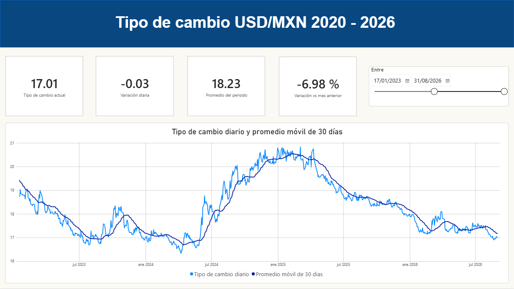

# Pipeline de datos: Tipo de cambio USD/MXN 2020 - 2026

Pipeline de datos que extrae el tipo de cambio USD/MXN desde la API REST de
Banxico, lo procesa con Python (Pandas y SQLAlchemy) y lo almacena en una base
de datos SQL Server. Sobre esa base se construyen vistas que alimentan un
reporte interactivo en Power BI.



## Arquitectura

```
API Banxico  →  JSON crudo  →  Pandas  →  SQL Server  →  Vistas  →  Power BI
```
## Estructura del proyecto

```
pipeline-tipo-de-cambio/
├── data/raw/              # Respuestas JSON sin procesar (no versionadas)
├── docs/                  # Captura del reporte
├── powerbi/               # Archivo .pbix del reporte
├── sql/
│   ├── 01_crear_tablas.sql
│   └── 02_vistas.sql
├── src/
│   ├── 01_extract.py      # Consulta la API y guarda el JSON crudo
│   ├── 02_transform.py    # Limpia y valida con Pandas
│   └── 03_load.py         # Carga idempotente a SQL Server
├── .env.example
└── README.md
```

## Decisiones de diseño

- **Se guarda la respuesta cruda antes de transformarla.** Permite reprocesar
  los datos sin volver a consultar la API si se corrige la lógica de limpieza.
  Banxico también recomienda almacenar la información en lugar de consultar
  repetidamente.

- **La carga es idempotente.** El pipeline descarga el rango histórico completo
  en cada ejecución, por lo que la mayoría de los registros ya existen en la
  base. Para evitar duplicados, la carga borra las fechas entrantes e inserta
  de nuevo, todo dentro de una transacción. Ejecutar el pipeline varias veces
  deja siempre el mismo resultado.

- **Las transformaciones viven en vistas de SQL, no en Pandas.** Los cálculos
  de variación y promedios móviles se resuelven con funciones de ventana en la
  base de datos. Así la lógica queda disponible para cualquier herramienta que
  se conecte, sin depender de Power BI.

- **El archivo .pbix no está versionado.** Contiene los datos importados y pesa
  demasiado para un repositorio. El reporte se reproduce conectando Power BI a
  la base de datos local; la captura en `docs/` muestra el resultado.
